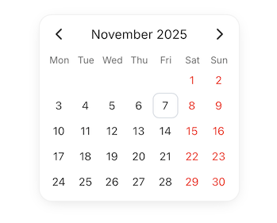

# Ккомпонент календаря на Vue 3 + TypeScript



Простой компонент календаря для тестового задания Frontend разработчика.

[Посмотреть на Github Pages](https://annagolmakova.github.io/vue-account-table-test/)

## Использование компонента

Базовое использование

```Vue
<Calendar @change="console.log" />
```

С дополнительными опциями:

```Vue
<Calendar
  locale="en-US"
  selectedDay="2025-12-31"
  :highlightw-weekends="true"
  :show-weekdays="true"
  :show-dates-out-of-month="false"
  @change="console.log"
/>
```

1. В календарь можно передать дату в формате ISO 8601 `2025-11-12` или в виде `new Date()`, тогда календарь откроется на этом месяце и этот день будет выбран.
2. Каледарь принимает настройку локали `<Calendar :locale="de-BE" />`. Локаль переключает как язык лейблов, так и то какой день недели будет первым. Значение по-умолчанию `ru-RU`
3. Свойство `:highlightw-weekends` выделяет красным цветом выходные дни
3. Свойство `:show-weekdays` управляет отображением дней недели
3. Свойство `:show-dates-out-of-month` управляет отображением дней за пределом текущего месяца
